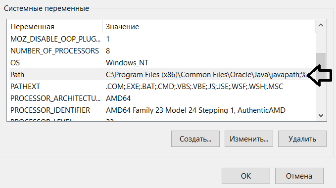

#Как использовать SSL в своем микросеврисе
Для начала нужно убедиться, что каталог, в котором находится исполняемый файл keytool, находится в вашей %PATH%переменной среды.

Например:



В рамках работы с сертификатами обычно 
используется контейнер PKCS 12 для хранения ключей и 
сертификатов.
Для работы с хранилищем JDK поставляется с 
консольной утилитой keytool.
Создадим самозаверяющий сертификат:

```
keytool -genkey -alias tomcat -storetype PKCS12  -keyalg RSA -keysize 2048 -keystore keystore-example.p12 -validity 365
```

Сертификат создается в формате X.509. В этом формате в качестве идентификатора владельца используется Distinquished Name или просто DN в формате X.500. Этот же формат идентификации объектов используется в LDAP-протоколе или в SNMP. Distinquished Name задается в виде разделенных через запятую атрибутов :

+ CN — common name (имя владельца);
+ OU — organizational unit or department/division (департамент/отдел);
+ O — organization name (наименование организации);
+ L — locality or city (город/местоположение);
+ ST — state or province;
+ C — country, two chars (страна).

Например:


Созданный нами сертификат помещаем в директорию микросервиса:


